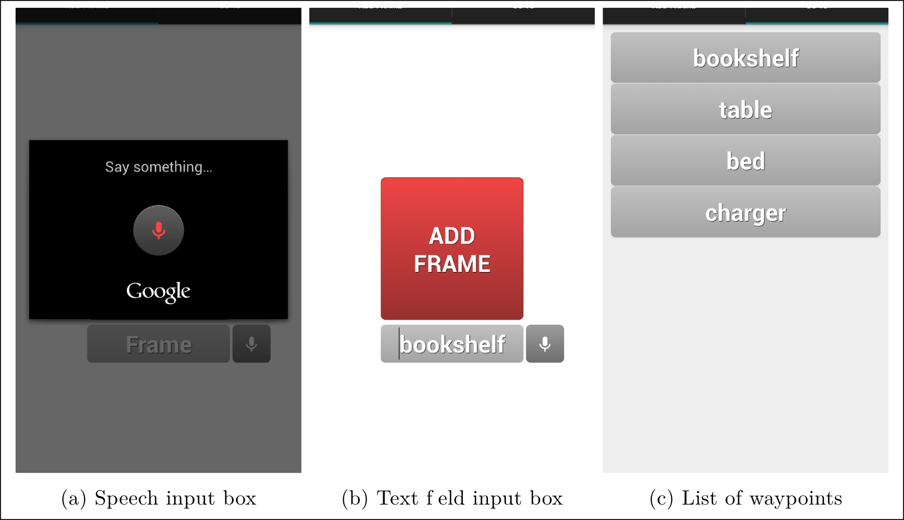

# The Ranger Android application

This is a simple Android application allowing to publish entered text string over a ros topic with ability to see the history of all published strings.

This app is customized for the Ranger robot to add waypoint(frame) names, where the list of waypoints is employed for navigation.

  

